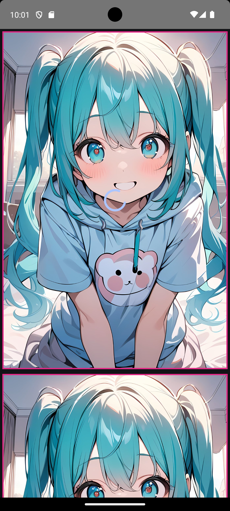
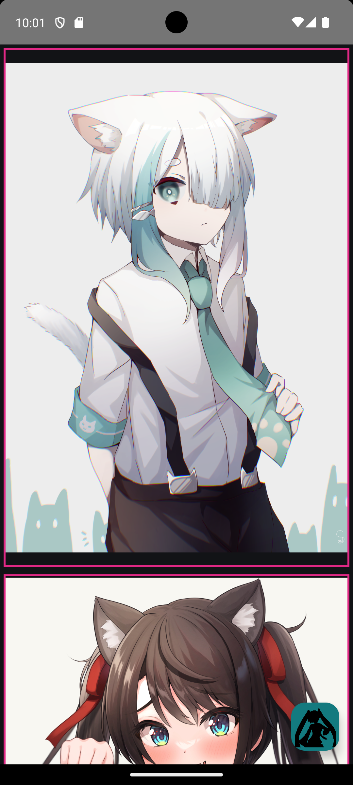

# LazyCat

Compose grid of cat images from the Nekos API. Tap through to a full image; includes a helper to save pictures.

## Screenshots

Loading a batch (placeholder + spinner; the refresh button hides until the request finishes):



Feed with the green Hatsune Miku refresh button:



## Stack

Kotlin, Jetpack Compose, Retrofit, ViewModel.

## Run

Open the project in Android Studio and run the `app` configuration.

```bash
./gradlew :app:assembleDebug
```
